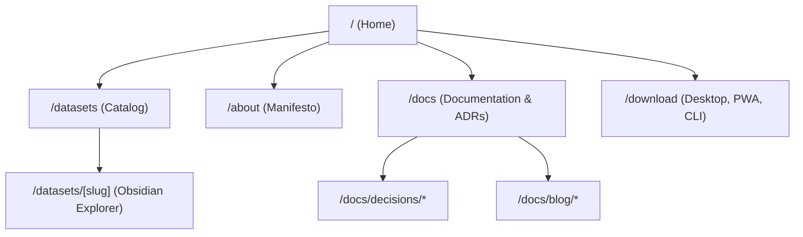

# DataMesh Design Specification & Agent Guide (`DESIGN.md`)

This document is the official architectural and visual design standard for the **DataMesh Bolivia** sovereign data catalog. It is specifically structured for **Agent Design Edits**—enabling autonomous AI coding agents to understand visual hierarchy, inspect machine-readable tokens, and execute targeted aesthetic or layout modifications without regressions.

---

## 1. Visual Philosophy & Identity

The portal adopts an editorial and institutional aesthetic that combines:
- **Journalistic Gravitas:** High typographic elegance inspired by reference data outlets (*Our World in Data*, *ProPublica*, *The Economist*). Headings use editorial serif typography to convey institutional permanence.
- **Swiss Modernism:** Minimalist grids, asymmetric clarity, high content density, and absolute elimination of decorative fluff.
- **Zero Decorative Clutter:** No generic gradient backgrounds, no rounded badge pills, no decorative emoji icons, no unnecessary card shadows.

---

## 2. Inviolable Design Constraints

Any human or AI agent modifying this project must uphold these core rules:

### A. The Strict "No Badges / No Tags" Policy
- **No pill containers or badge capsules:** Never render metadata (formats, licenses, tags, versions) as rounded pill chips (`.badge`, `.tag`).
- **Typography as Interface:** Express metadata through clean monospace text (`var(--font-mono)`), muted colors (`var(--color-text-muted)`), and subtle separators (`/` or `•`).
- **No Frontmatter Tags in UI:** Even if dataset frontmatter contains `tags: [...]`, the UI must not render them as badges.

### B. Institutional Neutrality
- The portal is a generic, sovereign template for public and private organizations.
- Never hardcode personal names, specific whitepaper DOIs, or private conference/social media recordings in templates, footers, or `portal.config.ts`.
- Content must remain strictly institutional, objective, and reproducible.

### C. Obsidian-Style File Explorer (Zero Scroll Viewport)
The dataset viewer (`/datasets/[slug]`) must function as a desktop-grade knowledge IDE:
1. **Bounded Viewport:** Height must match `calc(100vh - var(--header-height) - 3rem)`. The browser window must **never** scroll; only internal panels scroll independently.
2. **Native Button Resets:** `button.obsidian-file-item` must always declare `all: unset;` to prevent browser user-agent `buttonface` styling, 3D borders, or blue outline boxes.
3. **No Redundant Headers:** The template must **not** render a duplicate `<h1>` title banner above the markdown content. The document's own `index.md` provides the primary title and context.
4. **Iconography:** Monospace text and vector SVGs only. No colorful emojis.

---

## 3. Design Tokens Reference

All design tokens are mirrored between the YAML frontmatter above and `src/styles/theme.css`:

| Token Category | CSS Variable | Value (Light) | Value (Dark) | Description |
| :--- | :--- | :--- | :--- | :--- |
| **Primary** | `--color-primary` | `#0f766e` | `#2dd4bf` | Teal cívico, enlaces activos, interacción principal |
| **Hover** | `--color-primary-hover` | `#115e59` | `#5eead4` | Estado hover de botones y enlaces |
| **Subtle** | `--color-primary-subtle` | `#f0fdfa` | `#132e2d` | Fondo sutil de foco e indicador activo de archivo |
| **Accent** | `--color-accent` | `#c2410c` | `#fb923c` | Ocre / terracota para destacados y llamadas cívicas |
| **Background** | `--color-bg` | `#fcfbf9` | `#111618` | Fondo papel cálido editorial para lectura cómoda |
| **Surface** | `--color-surface` | `#ffffff` | `#1a2023` | Tarjetas, header, sidebar de explorador, inputs |
| **Surface Hover**| `--color-surface-hover` | `#f5f3ef` | `#242b30` | Hover en elementos de árbol, encabezado de tablas |
| **Border** | `--color-border` | `#e7e5e4` | `#2a3338` | Divisores de layout, marcos de tarjetas |
| **Text** | `--color-text` | `#1c1917` | `#f5f5f4` | Texto carbón cálido de alta legibilidad |
| **Muted Text** | `--color-text-muted` | `#57534e` | `#a8a29e` | Metadatos, breadcrumbs, descripciones |
| **Typography Serif** | `--font-serif` | Newsreader / Charter | Newsreader / Charter | Encabezados editoriales (H1, H2, H3, Hero) |
| **Typography Sans** | `--font-sans` | Inter / System | Inter / System | Standard interface and body text |
| **Typography Mono** | `--font-mono` | JetBrains Mono / Fira | JetBrains Mono / Fira | File explorer, schemas, code, indicators |
| **Radius MD** | `--radius-md` | `8px` | `8px` | Standard button and input corner radius |
| **Radius LG** | `--radius-lg` | `12px` | `12px` | Card and explorer container radius |
| **Max Width** | `--max-width` | `1060px` | `1060px` | Content reading column limit |

---

## 4. Agent Design Edit Protocol

When an AI coding agent is tasked with adjusting themes, styling, or layouts:

1. **Token First:** Modify values in the `colors` or `typography` sections of `DESIGN.md` and replicate them in `src/styles/theme.css`.
2. **Never Inject Inline Styles for Colors:** Always use CSS variables (`var(--color-...)`) rather than hardcoded hex codes in `.astro` files.
3. **Verify Dark Mode Parity:** When introducing a new color variable, define both light mode `:root` and dark mode `[data-theme="dark"]` values.
4. **Preserve Button Resets:** When styling custom clickable items in the sidebar or tree view, ensure `all: unset; box-sizing: border-box; display: flex; width: 100%;` are applied.
5. **Run Verification:** After any design change, execute:
   ```bash
   npm run audit
   npm run build
   ```

---

## 5. Route Architecture & Component Specifications

The application is strictly limited to 5 canonical routes:



### Route Design Directives
- **`/` (Home):** Editorial hero, monospace stats, recent datasets grid, recent blog posts. Minimalist, uncluttered presentation.
- **`/datasets`:** Instant search input, category filters (minimal text buttons, not badges), responsive dataset cards featuring title, description, and metadata row.
- **`/datasets/[slug]`:** Obsidian IDE explorer:
  - Left pane: 290px fixed tree view, collapsible folders (`01_CONTEXT`, `02_DATA`, `03_CONTRACTS`), SVG icons.
  - Right pane: Action bar with raw file links, breadcrumbs, and zero-scroll internal viewport.
- **`/about`:** Long-form prose detailing the 4 data mesh principles (Domain Ownership, Data as a Product, Self-serve Infrastructure, Federated Governance).
- **`/docs`:** Architecture Decision Records (ADRs) table, normative guides, and technical blog index.
- **`/download`:** Technical instructions for Electron binary builds, PWA installation, and Go SDK CLI compilation.
